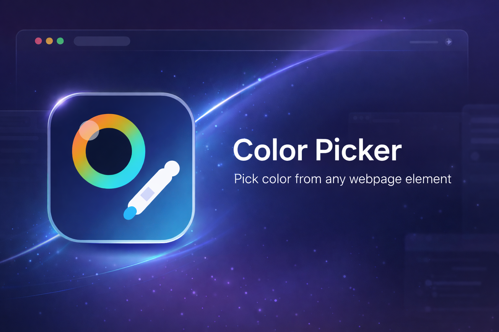

# Haroone Color Picker



Haroone Color Picker is a Chrome Manifest V3 extension for picking colors directly from the visible page, including images, banners, gradients, and small UI details. It opens a live in-page picker, shows a zoomed pixel preview, lets you copy `HEX`, `RGB(A)`, or `HSL(A)`, and stores your preferences, recents, and favorites locally.

## Highlights

- Real pixel picking from the visible tab, not just computed CSS values.
- Works on images, banners, product photos, backgrounds, and small interface elements.
- Live in-page panel with zoom preview, primary color display, copy actions, and reset flow.
- Popup auto-starts the picker on supported pages.
- One-click copy for `HEX`, `RGB`, and `HSL`.
- Recent colors, favorites, and persistent settings.
- Minimal Chrome permissions: `activeTab`, `scripting`, and `storage`.

## Features

### In-page picker

- Hover anywhere on the page to sample the current pixel.
- Click to lock a color.
- Use the zoomed pixel grid for precise selection.
- Press `Reset` to continue picking without closing the panel.
- Press `Esc` to exit.
- Press `Enter` to copy the default format.

### Popup workflow

- Open the popup and the picker starts automatically on supported tabs.
- View the current picked color and copy it from the popup.
- Save colors to favorites.
- Review recent colors.
- Change default format, alpha handling, recents behavior, overlay behavior, and theme.

### Persistence

Saved with `chrome.storage.local`:

- default copy format
- copy-on-click behavior
- alpha display preference
- recent color history and limit
- favorites
- keep-overlay-open preference
- popup theme preference

## Install

### Load unpacked in Chrome

1. Open `chrome://extensions`.
2. Enable `Developer mode`.
3. Click `Load unpacked`.
4. Select the `color picker` folder.

## How To Use

1. Open a normal website.
2. Click the extension icon.
3. Move your cursor over the page.
4. Click to lock a color.
5. Copy with `HEX`, `RGB`, or `HSL`.
6. Use `Reset` to pick another color.

Keyboard shortcut:

- Windows/Linux: `Ctrl+Shift+Y`
- macOS: `Command+Shift+Y`

## Permissions

- `activeTab`
  - gives access to the current tab only when the user starts the picker
- `scripting`
  - injects the picker overlay on demand
- `storage`
  - saves settings, recents, and favorites locally

## Project Structure

```text
color picker/
├─ assets/img/color-picker.png
├─ background.js
├─ content.js
├─ icons/
├─ manifest.json
├─ popup.css
├─ popup.html
├─ popup.js
└─ README.md
```

## Current Behavior

- Uses `chrome.tabs.captureVisibleTab()` to sample actual page pixels.
- Refreshes the capture when the page scrolls or resizes.
- Shows a strong visual status message inside the picker panel.
- Keeps the in-page panel focused on the primary sampled color.

## Limitations

- Chrome blocks extensions on pages like `chrome://`, the Chrome Web Store, and some internal browser surfaces.
- Cross-origin iframe contents are not directly pickable.
- The picker samples the visible page area, so results depend on what is currently on screen.

## Development Notes

- Manifest version: `3`
- Architecture: popup + background service worker + on-demand injected content script
- Data storage: `chrome.storage.local`

## License

This repository does not currently include a license file.
